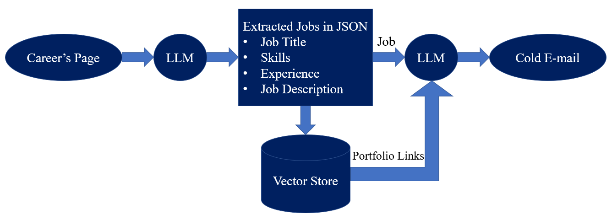
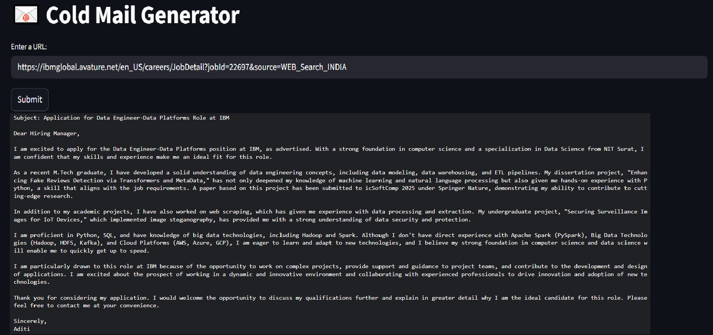

# ❄️ Cold Email Generator for Job Applications

This project is an AI-powered cold email generator tailored specifically for job seekers. By analyzing career pages using Large Language Models (LLMs), it extracts job-related information and generates personalized cold emails to help candidates stand out in their outreach.

## 🚀 Features
- Extracts job data (title, skills, experience, description) from career pages using LLMs.
- Stores portfolio links in a vector database for semantic search and relevance.
- Generates context-aware cold emails customized for specific job roles.
- Simple and interactive UI built with Streamlit.

## 🧠 How It Works
1. **Input**: A user submits a job listing URL.
2. **Extraction**: An LLM extracts structured job data (JSON format).
3. **Retrieval**: Relevant portfolio links are fetched from a vector store.
4. **Generation**: An LLM uses the job details and portfolio context to generate a tailored cold email.
5. **Output**: The email is presented in a professional, ready-to-send format.

## 📊 Architecture

## 🖥️ Output Screen

## 💡 Use Case
Ideal for:
- Job seekers applying to roles directly through company websites.
- Students or early-career professionals wanting to personalize their outreach.
- Automating tailored job application emails at scale.

## 🛠️ Technologies Used
- **Python** – Core programming language
- **Streamlit** – Interactive UI for submitting job URLs and viewing results
- **LangChain** – For LLM orchestration and chaining tasks
- **Groq API** – LLM backend for cold email generation ([Get API Key](https://console.groq.com/keys))
- **ChromaDB** – Vector store used to store and semantically match portfolio links based on job descriptions
- **Web Scraping** – To extract job descriptions and metadata from career pages
